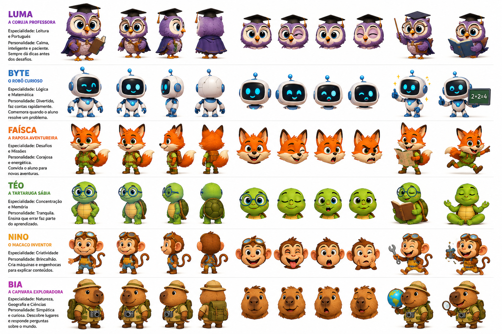

# Personagens e animacoes

Documento de referencia para design, frontend e implementacao das animacoes dos personagens do jogo educativo.

## Asset principal

- Arquivo original salvo na aplicacao: `frontend/public/assets/characters/personagens-referencia.png`
- Caminho publico no frontend: `/assets/characters/personagens-referencia.png`
- Uso recomendado: referencia visual para recortes, sprites, estados de expressao e poses dos mascotes.



## Spritesheets gerados

Data: 2026-06-29

Os primeiros spritesheets foram gerados diretamente da imagem de referencia para manter fidelidade visual aos personagens aprovados.

Pasta publica:

- `frontend/public/assets/characters/sprites/`

Metadados:

- `frontend/public/assets/characters/sprites/sprites.json`
- `frontend/src/data/characterSprites.js`

Componente de uso no front:

- `frontend/src/components/characters/CharacterSprite.jsx`

Cada spritesheet usa celulas de `256x256`, com 5 frames por personagem. O frame `0` deve ser tratado como `idle`/pose base.

| Personagem | Spritesheet | Frames |
| --- | --- | --- |
| Luma | `/assets/characters/sprites/luma-spritesheet.png` | `idle`, `front`, `mirror`, `hint`, `read` |
| Byte | `/assets/characters/sprites/byte-spritesheet.png` | `idle`, `front`, `mirror`, `thumbs`, `board` |
| Faisca | `/assets/characters/sprites/faisca-spritesheet.png` | `idle`, `front`, `mirror`, `map`, `run` |
| Teo | `/assets/characters/sprites/teo-spritesheet.png` | `idle`, `front`, `mirror`, `read`, `meditate` |
| Nino | `/assets/characters/sprites/nino-spritesheet.png` | `idle`, `front`, `mirror`, `tool`, `gadget` |
| Bia | `/assets/characters/sprites/bia-spritesheet.png` | `idle`, `front`, `mirror`, `globe`, `magnify` |

Observacao importante:

- Estes sprites sao um primeiro recorte tecnico da referencia.
- Os frames laterais que ficavam cortados na prancha foram substituidos por frames espelhados de poses completas.
- A versao corrigida remove sobras de texto, linhas divisorias e fragmentos pequenos de poses vizinhas.
- Os recortes foram refeitos com margem superior maior para evitar cabecas, chapeus, antenas e oculos cortados.
- As animacoes atuais usam respiracao suave e troca de frames em hover/entrada.
- Para movimentos realmente fluidos quadro a quadro, sera necessario gerar frames intermediarios ou spritesheets dedicados por acao.

## Sequencias PNG para hover no front

Data: 2026-06-29

O elenco principal da Home passou a usar os PNGs separados da pasta:

- `frontend/public/assets/personagens_sprites/`

Componente:

- `frontend/src/components/characters/CharacterSprite.jsx`

Comportamento:

- Estado parado: sequencia `idle`.
- Ao passar o mouse/focar o card: toca uma sequencia curta de aceno/expressao.
- O hover e controlado pelo card inteiro, nao apenas pela imagem do personagem.

Mapa de acoes usadas no hover:

| Personagem | Acao no hover |
| --- | --- |
| Luma | `falando` |
| Byte | `falando` |
| Faisca | `emocoes` |
| Teo | `emocoes` |
| Nino | `emocoes` |
| Bia | `acenando` |

Observacao: quando houver sprites dedicados de `acenando` para todos os personagens, trocar o hover para usar essa acao em todos.

## Combinado de trabalho

- Codex: responsavel por design, experiencia visual, frontend, organizacao de assets, estados de UI e documentacao visual.
- Claude Code: responsavel por programacao principal, backend, regras de negocio, APIs e integracoes.
- Ao criar ou alterar animacoes, registrar neste arquivo: personagem, estado, gatilho, duracao, asset usado e observacoes para implementacao.

## Direcao visual geral

- Estilo: infantil, educativo, colorido, acolhedor e expressivo.
- Movimento: suave, curto e com resposta clara ao aluno.
- Ritmo: animacoes de feedback devem ser rapidas; animacoes de celebracao podem durar um pouco mais.
- Prioridade: expressao facial primeiro, pose corporal depois, efeitos visuais por ultimo.
- Acessibilidade: evitar flashes rapidos; manter movimentos opcionais ou reduzidos se houver modo de acessibilidade.

## Personagens

### Luma

- Tipo: coruja professora.
- Area: leitura e portugues.
- Personalidade: calma, inteligente e paciente.
- Papel na aplicacao: dar dicas antes dos desafios, explicar leitura, reforcar interpretacao e orientar o aluno.
- Cores principais: roxo, lilas, dourado e preto.

Animacoes iniciais:

| Estado | Gatilho | Ideia de movimento | Duracao sugerida |
| --- | --- | --- | --- |
| Idle | Tela parada | Piscar, leve balanco do corpo, livro respirando levemente | Loop 2s-4s |
| Dica | Aluno pede ajuda | Levanta o livro ou ponteiro, inclina cabeca | 800ms-1200ms |
| Acerto | Resposta correta | Abre asas pequenas, olhos felizes | 900ms |
| Erro leve | Resposta incorreta | Pisca devagar, expressao acolhedora, gesto de tentar de novo | 900ms |
| Leitura | Atividade de texto | Olhos acompanham livro, pequeno virar de pagina | Loop curto |

### Byte

- Tipo: robo curioso.
- Area: logica e matematica.
- Personalidade: divertido, rapido e encorajador.
- Papel na aplicacao: comemorar resolucao de problemas, mostrar contas e feedback numerico.
- Cores principais: branco, azul, ciano e preto.

Animacoes iniciais:

| Estado | Gatilho | Ideia de movimento | Duracao sugerida |
| --- | --- | --- | --- |
| Idle | Tela parada | Antena mexe, olhos piscam em LED | Loop 2s-3s |
| Pensando | Questao de logica | Tela facial mostra pontinhos ou expressao curiosa | 1000ms |
| Acerto | Conta correta | Joinha, brilho azul e rosto sorrindo | 900ms |
| Erro leve | Conta errada | Tela mostra surpresa suave, depois sorriso de incentivo | 900ms |
| Explicacao | Mostrar formula | Aponta para quadro ou card com conta | 1200ms |

### Faisca

- Tipo: raposa aventureira.
- Area: desafios e missoes.
- Personalidade: corajosa, energetica e exploradora.
- Papel na aplicacao: convidar o aluno para novas aventuras, desafios e fases.
- Cores principais: laranja, verde, creme e marrom.

Animacoes iniciais:

| Estado | Gatilho | Ideia de movimento | Duracao sugerida |
| --- | --- | --- | --- |
| Idle | Tela parada | Cauda balanca, orelhas reagem | Loop 2s-4s |
| Chamada | Nova missao | Pula ou aponta para frente com entusiasmo | 900ms |
| Acerto | Missao concluida | Sorriso grande, mapa abre, pequena celebracao | 1000ms |
| Alerta | Desafio dificil | Olhar focado, sobrancelha baixa, postura pronta | 700ms |
| Corrida | Transicao de fase | Passos rapidos laterais, mochila balanca | 1200ms |

### Teo

- Tipo: tartaruga sabia.
- Area: concentracao e memoria.
- Personalidade: tranquilo, paciente e reflexivo.
- Papel na aplicacao: reforcar que errar faz parte do aprendizado e ajudar em momentos de pausa.
- Cores principais: verde, amarelo, azul e marrom.

Animacoes iniciais:

| Estado | Gatilho | Ideia de movimento | Duracao sugerida |
| --- | --- | --- | --- |
| Idle | Tela parada | Respiracao calma, piscar lento | Loop 3s-5s |
| Meditar | Pausa ou foco | Senta, olhos fecham, maos relaxadas | Loop 2s-4s |
| Acerto | Boa sequencia | Sorriso discreto, aceno calmo | 900ms |
| Erro leve | Falha de memoria | Expressao compreensiva, gesto de tentar novamente | 1000ms |
| Dica de calma | Tempo acabando | Movimento lento de inspirar e expirar | 1500ms |

### Nino

- Tipo: macaco inventor.
- Area: criatividade.
- Personalidade: brincalhao, criativo e engenhoso.
- Papel na aplicacao: explicar conteudos com maquinas, ferramentas e experimentos visuais.
- Cores principais: marrom, laranja, azul e dourado.

Animacoes iniciais:

| Estado | Gatilho | Ideia de movimento | Duracao sugerida |
| --- | --- | --- | --- |
| Idle | Tela parada | Oculos mexem, rabo balanca, sorriso curioso | Loop 2s-3s |
| Inventando | Explicacao criativa | Mostra ferramenta ou dispositivo, faíscas visuais leves | 1200ms |
| Acerto | Solucao criativa | Pula feliz, ferramenta levanta | 900ms |
| Erro divertido | Tentativa falhou | Careta leve, dispositivo solta fumacinha suave | 1000ms |
| Ideia | Nova sugestao | Lampada/efeito de ideia, olhos abrem | 800ms |

### Bia

- Tipo: capivara exploradora.
- Area: natureza, geografia e ciencias.
- Personalidade: simpatica, curiosa e observadora.
- Papel na aplicacao: apresentar lugares, mapas, ciencia e perguntas sobre o mundo.
- Cores principais: marrom, bege, verde, amarelo e azul.

Animacoes iniciais:

| Estado | Gatilho | Ideia de movimento | Duracao sugerida |
| --- | --- | --- | --- |
| Idle | Tela parada | Olhar curioso, camera balanca levemente | Loop 2s-4s |
| Explorar | Abrir mapa ou mundo | Aponta para globo/mapa, sorriso curioso | 1000ms |
| Acerto | Descoberta correta | Levanta lupa ou globo com alegria | 900ms |
| Observacao | Pergunta de ciencia | Aproxima lupa, inclina corpo | 900ms |
| Descoberta | Novo lugar/conquista | Pequeno brilho, pose de exploradora | 1200ms |

## Estados globais de animacao

Usar estes nomes como padrao para frontend e backend quando forem referenciar estados:

- `idle`
- `intro`
- `hint`
- `thinking`
- `correct`
- `wrong-soft`
- `celebrate`
- `explain`
- `transition`
- `accessibility-reduced-motion`

## Registro de novas animacoes

Copiar este modelo quando uma animacao nova for definida:

```md
### Nome da animacao

- Personagem:
- Estado:
- Gatilho na aplicacao:
- Asset/spritesheet:
- Duracao:
- Loop: sim/nao
- Som associado:
- Observacoes de design:
- Observacoes para Claude/backend:
```

## Pendencias

- Recortar cada personagem em assets separados.
- Definir se o frontend vai usar PNG sequencial, spritesheet, Lottie, Spine ou animacao CSS/Canvas.
- Criar nomes finais dos arquivos por personagem.
- Definir tamanhos padrao para uso em telas desktop e mobile.
- Validar contraste e legibilidade quando o personagem aparecer perto de textos.
